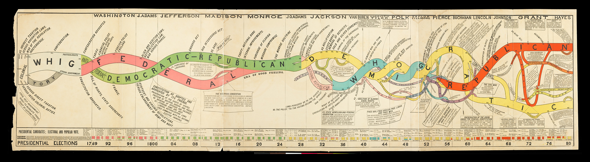
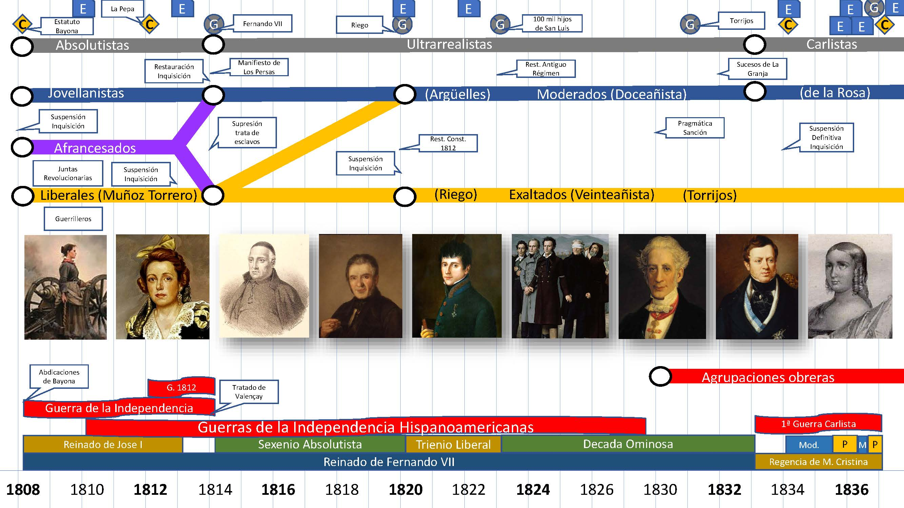
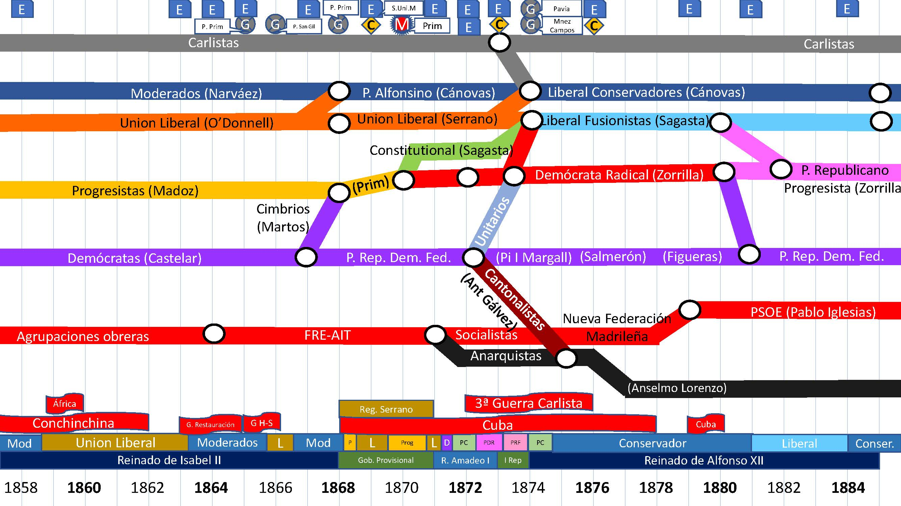
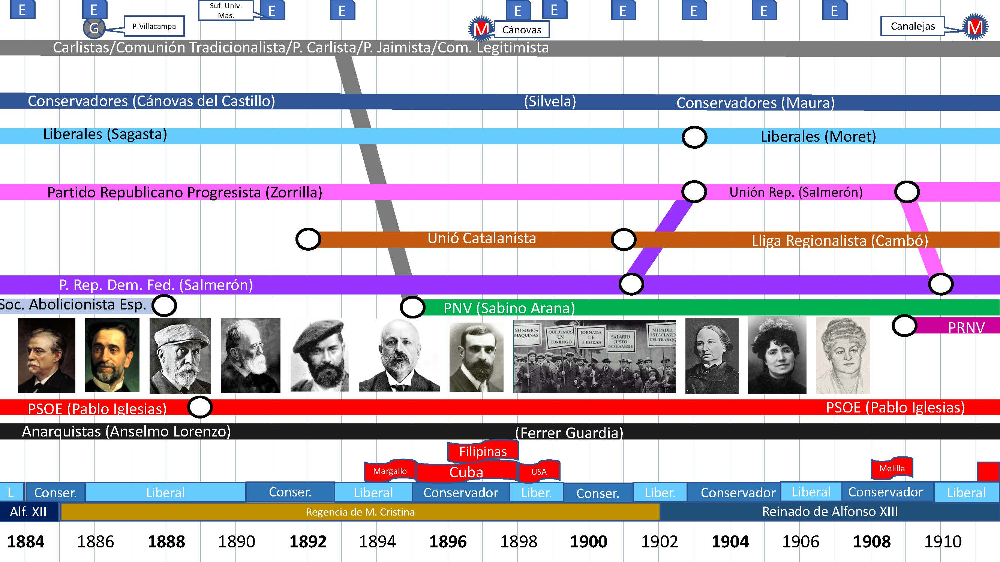
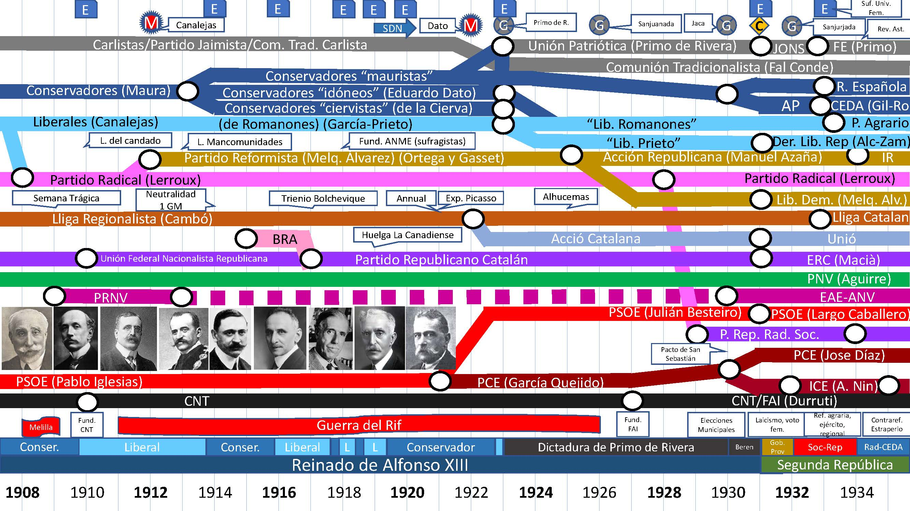
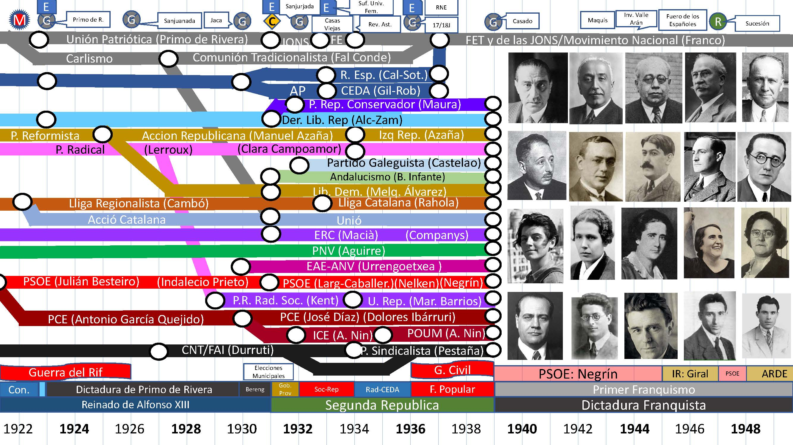
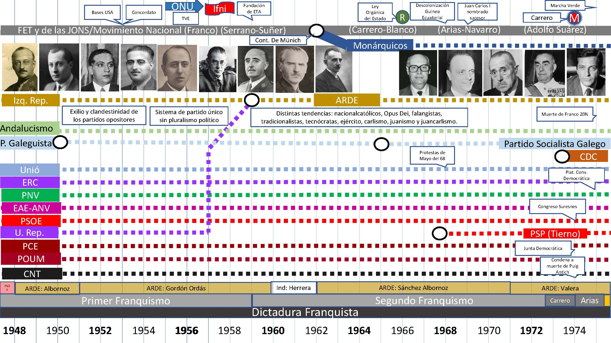
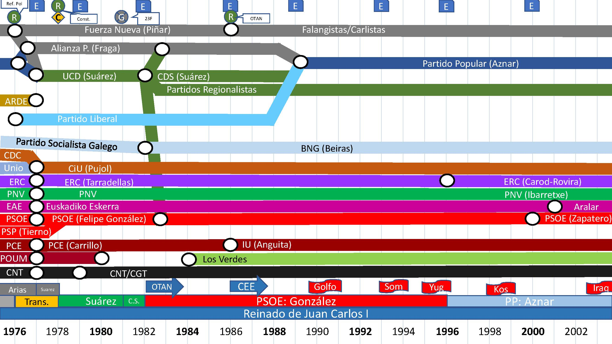
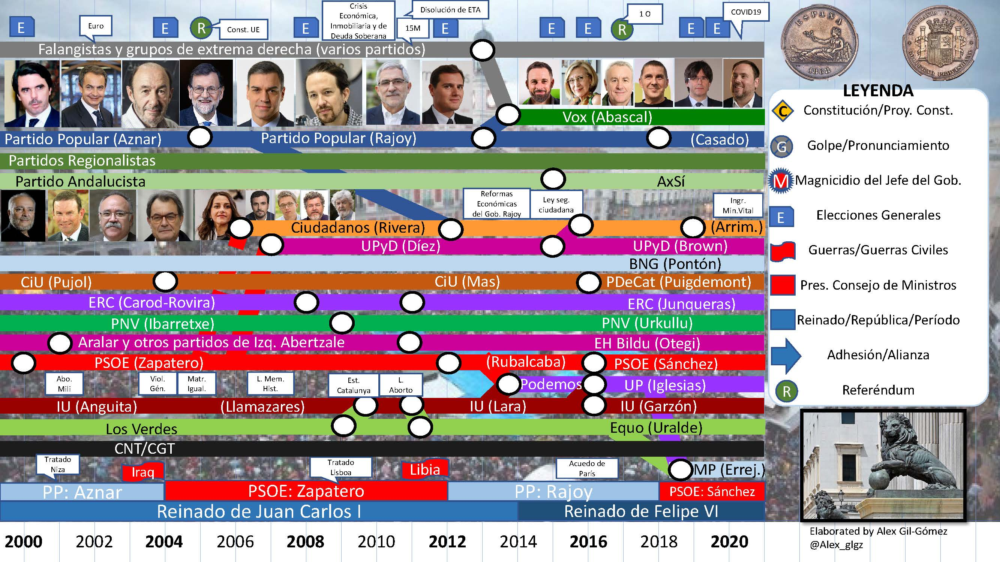

# Historia de España

En este repositorio encontrarás diapositivas (pdf/pptx) que muestran la evolución de los principales particos políticos y corrientes ideológicas presentes en España desde 1808 a 2020. Me he inspirado en este gráfico estilo [mapa de metro elaborado para los partidos políticos de Estados Unidos](https://www.martyduren.com/2016/03/04/a-brief-history-on-american-political-parties/).

## Trabajo inspirado en este esquema de la historia de los partidos politicos de 1790 a 1880.

En 1880 Walter R. Houghton desarrolló este  esquema. “Diagram of the Rise and Fall of American Political Parties, from 1789 to 1880, inclusive,” from Conspectus of the History of Political Parties and the Federal Government.

## 1808-1836

Empezando con la Guerra de la Independencia (1808-1814). En este período caracterizado por la crisis del Antiguo Régimen tenemos a los partidarios del absolutismo, los moderados, liberales, afrancesados y la formación de las primeras agrupaciones obreras. 1/9

## 1834-1860

Con la muerte de Fernando VII y las revoluciones de 1848, aparecen en España nuevos partidos políticos como el Partido Demócrata (1849), que apoya el Sufragio Universal (solo el masculino). Espartero es el líder de los Progresistas y O´Donell funda la Unión Liberal. 2/9

## 1858-1884

El reinado de Isabel II entrará en una crisis que culminará en el Sexenio Democrático (1868-1874). En 1869 se reconoce el Sufragio Universal (solo el masculino). También tendremos el reinado de Amadeo I y la escisión de socialistas y anarquistas con la I Internacional. 3/9

## 1884-1910

Desde 1874 tenemos el periodo de la Restauración. Aquí vemos como dos partidos (liberal y conservador) se turnan en el poder. No será hasta 1890 cuando se vuelva a restablecer el Sufragio Universal masculino. También vemos la aparición de partidos como el PNV o el PSOE. 4/9

## 1908-1934

Se empieza a complicar la historia. Con la crisis de la Restauración y la dictadura de Primo de Rivera, aparecen nuevas organizaciones políticas que se aglutinarán en torno al Pacto de San Sebastián (1930) resultando en la caída de Alfonso XIII. 5/9

## 1922-1948

Con la Segunda República las mujeres españolas votan por primera vez (1933). El Partido Comunista se funda en 1921, y ERC en 1931. También aparecerán otros partidos nacionalistas y regionalistas. Tras la Guerra Civil la mayoría de partidos son ilegalizados en España. 6/9

## 1948-1974

La Dictadura Franquista se basa en un partido único, mientras los partidos políticos pasan a la clandestinidad debido a la represión o desarrollan sus actividades en el exilio. La barra inferior indica tanto los gobiernos republicanos en el exilio como los periodos franquistas. 7/9

Imágenes (de izquierda a derecha): Miguel Primo de Rivera, José Antonio Primo de Rivera, José Calvo Sotelo, Fal Conde, Gil Robles, Emilio Mola, Francisco Franco, Serrano-Suñer, Herrera Oria, López Rodó, Fraga, Arias Navarro, Carrero Blanco, Adolfo Suárez.

## 1976-2002

Con la Ley para la Reforma Política y la Constitución de 1978 observamos nuevos cambios en el espectro político, principalmente la UCD se funda en 1977 y el Partido Popular en 1989. Tras 1982 se turnarán en el gobierno el PSOE y el PP. 8/9

Imágenes (de izquierda a derecha): Carrillo, Tierno Galván, Felipe González, Tarradellas, Pujol, Arzalluz, Torcuato Fernández Miranda, Leopoldo Calvo Sotelo, Blas Piñar.

## 2000-2020

En los últimos 20 años hemos visto la aparición de nuevos partidos políticos como Ciudadanos (2005), UPyD (2007), Vox (2013) y Podemos (2014). 
Los símbolos de encima del gráfico muestran distintos eventos políticos como constituciones, elecciones generales, guerras, etc.
9/9

Imágenes: 
Moneda de 1868 emitida por el Gobierno Provisional después de la Revolución Gloriosa, la figura fue tomada de monedas romanas de trajano y es una alegoría de Hispania. El escudo contiene los antiguos reinos que forman el Estado Español y está coronado por un castillo y rodeado por el texto: Soberanía Nacional, Gobierno Provisional.

Leones del Congreso de los Diputados guardando la sede del poder legislativo.

Políticos (de izquierda a derecha): Aznar, Zapatero, Rubalcaba, Rajoy, Sánchez, Iglesias, Llamazares, Rivera, Abascal, Díez, Lara, Otegi, Puigdemont, Junqueras.

Anguita, Ibarretxe, Carod Rovira, Mas, Arrimadas, Garzón, Errejón, Uralde, Beiras.

## Algunos gifs de trenes

